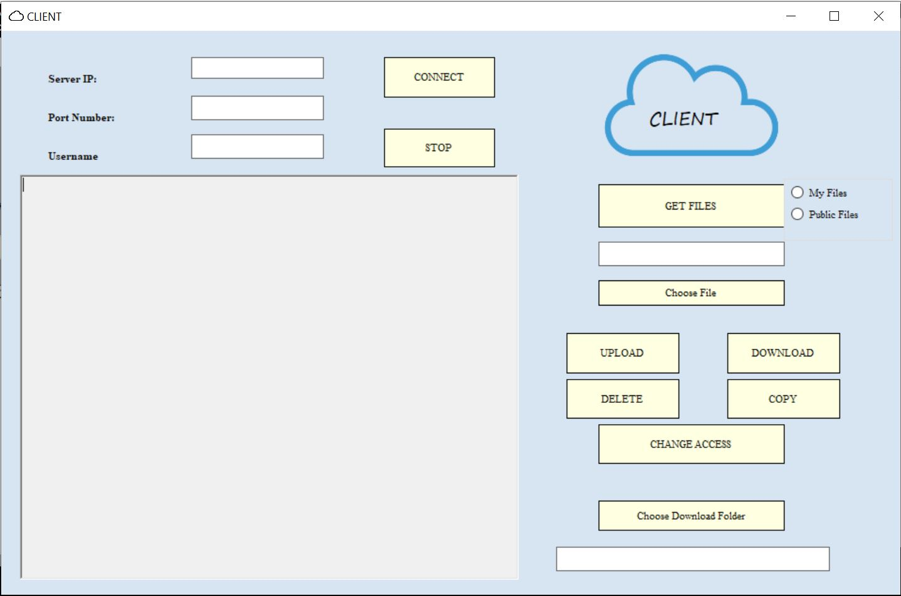
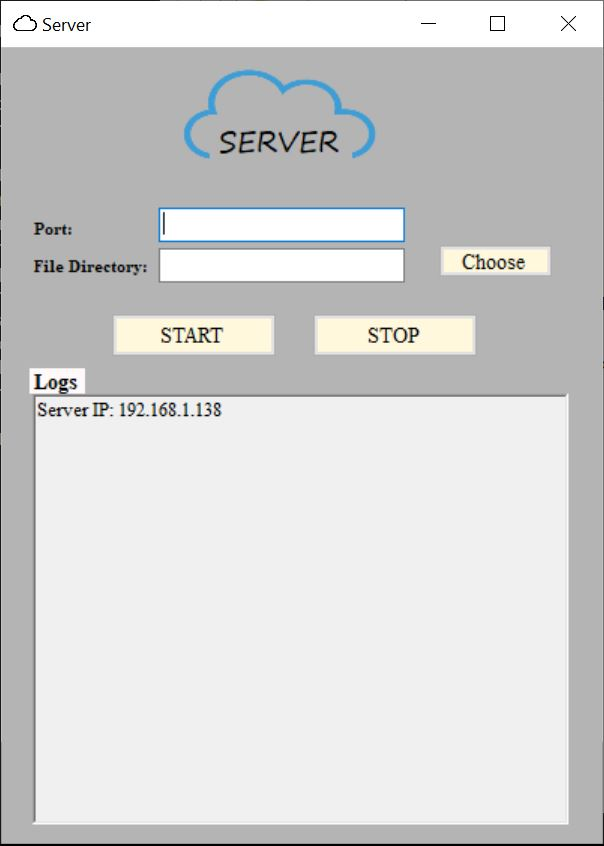

# CS 408 Project FALL 2020-2021 - Sabancı University

- Giray Coşkun - 25137 - giraycoskun@sabanciuniv.edu
- Cankut Coşkun - 23776 - cankutcoksun@sabanciuniv.edu
- Dilara Müstecep - 25292 - dilaramustecep@sabanciuniv.edu
- Can Savrun - 23706 - cansavrun@sabanciuniv.edu
- Mert Güngör - 24148 - mertgungor@sabanciuniv.edu

---
## Database Details

Visual Studio .NET mysql setup
- 1-)Mysql for visual studio -> https://dev.mysql.com/downloads/file/?id=491638
- 2-)Mysql connector .NET -> https://dev.mysql.com/downloads/connector/net/
- 3-)VS -> Server -> Tools-> connect to Database ->  

- host: https://remotemysql.com/phpmyadmin/
- username: ioI0xzbThf
- password: VGITbQxEEa

**Database Structure**
id(int) | fileName(string) | filePath(string) | owner(string) | incCount(int) | accessType(PUBLIC, PRIVATE)

Primary Key - id
UNIQUE (filename, owner)

**Public Static Objects for DB:**
- connectionstring = "server=remotemysql.com;userid=ioI0xzbThf;password=VGITbQxEEa;database=ioI0xzbThf"
- MySqlConnection databaseConnection = new MySqlConnection(connectionString);

**Database Functions:**

  
---

## Connection

### Server

**Helpful Docs:**
- Async Programs: https://docs.microsoft.com/en-us/dotnet/csharp/programming-guide/concepts/async/
- https://docs.microsoft.com/en-us/dotnet/framework/network-programming/asynchronous-server-socket-example

**GUI Elements**

- logBox : richtext box  for logs
- portBox : port number input
- fileBox : directory path input
- chooseButton: open file browser via folderBrowserDialog1 and sets it to fileBox
- startButton : starts server
- stopButton : stops server

**Libraries**

- using System;
- using System.Collections.Generic;
- using System.Linq;
- using System.IO;
- using System.Net;
- using System.Net.Sockets;
- using System.Text;
- using System.Threading;
- using System.Windows.Forms;

**Globals**

- int portNum;
- int MAX_CLIENT = 128;
- int MAX_BUF = (2 << 22);
- bool listening;
- string fileDirectory = "";
- Socket server;
- IPAddress ipAddress;
- List<Socket> clientSocketList = new List<Socket>() ;
- List<string> usernameList = new List<string>();

**Functions**

- public Form1()
- private void StartButton_Click(object sender, EventArgs e)
- private void StopButton_Click(object sender, EventArgs e)
- private void Accept()
- private void Receive(Socket thisClient)
- private bool CheckUsername(string username)
- private void HandleClient(Socket client, string username)
- private bool UploadCommand(Socket client, string commandMessage, string username, string filename)
- private int GetCopyIdFromFileName(String fullname)
- private string GetOriginalFileName(string fullname)
- private bool DownloadCommand(Socket client, string commandMessage, string username, string filename)
- private bool DeleteCommand(Socket client, string commandMessage, string username, string filename)
- private bool CopyCommand(Socket client, string commandMessage, string username, string filename)
- private bool ChangeAccessCommand(Socket client, string commandMessage, string username, string filename)
- private bool GetFileCommand(Socket client, string commandMessage, string username, string filename)
- private bool CheckOwnerFileValidity(string username, string filename, int incCount)
- private string CheckPublicFileValidity(string filename, int incCount)
- private string GetDirectoryFilename(string username, string filename)
- private string GetDirectoryFileName(FileDB.PrimaryKey pk)
- private void SendClientMessage(Socket client, string message)
- private void RejectClient(Socket client, string username)
- private void BrowseButton_Click(object sender, EventArgs e)
- private bool CheckConnection(Socket socket)
- private bool CheckEnd(Byte b)

**Possible Issues in Server:**

- Get IP adress of system: there are multiple IPs DNS.IPHostEntry ip = Dns.GetHostEntry(host); returns multiple IP addresses in ip.AdressList second is chosen and printed
	 
---	 
### Client

**Helpful Docs:**

**GUI Elements**

- ipBox: ip adress input
- portBox: port number input
- usernameBox: username input
- connectButton: start connection to server
- stopButton: stops connection
- uploadFileBox: shows full file path
- browseButton: opens file browser for .txt files
- uploadButton: start uploding file to server
- outputBox: shows messages

**Libraries**

- using System;
- using System.IO;
- using System.Net;
- using System.Net.Sockets;
- using System.Text;
- using System.Threading;
- using System.Windows.Forms;
- using System.Collections.Generic;

**Globals**

- int MAX_BUF = (2 << 22);
- IPAddress serverIPAddress;
- int serverPortNum;
- string username;
- string filepath;
- bool connected = false;
- Socket clientSocket;
- string DOWNLOAD_DIR = "";
- bool ACK_CHECK = false;
- private static ManualResetEvent mre = new ManualResetEvent(false);

**Functions**

- public CLIENT()
- private void ConnectButton_Click(object sender, EventArgs e)
- private void StopButton_Click(object sender, EventArgs e)
- private void EnableInputBoxes()
- private void UploadFile(string filepath)
- private void ListenServer()
- private bool CheckConnection(Socket socket)
- private void DownloadButton_Click(object sender, EventArgs e)
- private void SendServerMessage(Socket server, string message)
- private void GetFileButton_Click(object sender, EventArgs e)
- private void DeleteButton_Click(object sender, EventArgs e)
- private void ChangeAccessButton_Click(object sender, EventArgs e)
- private bool DownloadFile(string filename, string downloadDirectory)
- private bool GetFileList()
- private static bool CheckEmptyString(String s)

**Globals**

- MAX_BUF: int
- serverIPAdress: IPAdress
- serverPortNum: int
- username: string
- filepath: string
- coonected: bool
- clientSocket: Socket

**Possible Issues in Client:**

---
## BUGS

- **Issue: 1:** Upload button without connection -> fixed :+1:
- **Issue 2:** PortNUmber Input Check -> fixed :+1:
- **Issue 3:** PortNUmber Input Check -> fixed :+1:
- **Issue 3:** Box Enables after Disconnection -> fixed :+1:
- **Issue 4:** Server disconnection does not trigger client -> fixed :+1:
- **Issue 5:** Client Disconnection crashes Server !!! -> fixed :+1:
- **Issue 6:** Logging is missing in some points -> fixed :+1:
- **Issue 7:** Upload information is not sent to client -> fixed :+1:
- **Issue 8:** When Server is closed from cross when client threads running application is not really closed stays at line 151 -> fixed :+1:
- **Issue 9:** Database insert is not working!! -> fixed :+1:
- **Issue 10:** Server does not use thread safe GUI.
- **Issue 11:** Download Command does not use number of bytes. 

## TESTS

### Invalid Inputs

- Invalid Port Number
- Empty Directory
- Invalid IP adress

### File Sizes

- A few bytes
- 1000 kb
- 500 MB
- kapital.txt
- 4GB

### Disconnections

- User disconnection
- Server Disconnection

### Specifications

- Multiple Client Connection
- Reject already used usernames
- Multiple Client File Upload

---

## Screenshots
### Client Screen

### Server Screen

